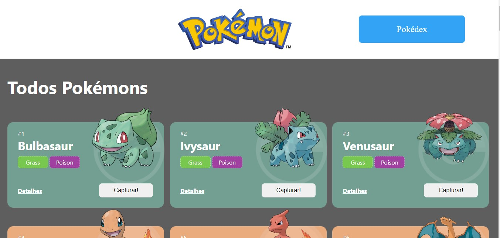
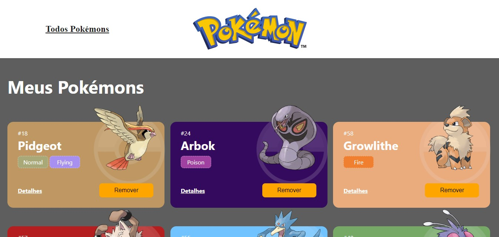
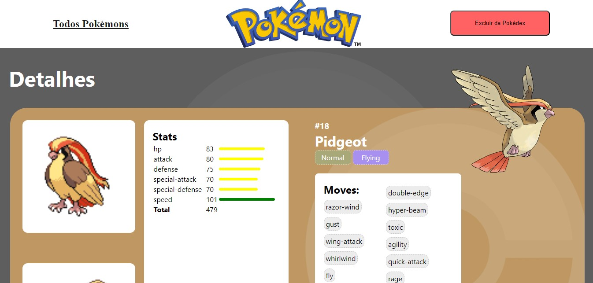

# Projeto Pokédex

<div style="display: flex;justify-content:center;">

</div>
<div style="text-align:justify; margin: 20px 0">
O projeto consiste em um site com 3 páginas. A página principal contém uma lista de pokémons que podem ser capturados pelo usuário. Através da página principal, o usuário é capaz de acessar sua pokédex pelo botão "Pokédex", onde é possível visualizar os pokémons já capturados, bem como removê-los da sua pokédex. Em ambas as páginas, o usuário pode pressionar o botão "Detalhes" em qualquer pokémon para acessar uma página contendo os atributos e demais informações do pokémon selecionado.
        As informações dos pokémons contidos neste projeto foram obtidas por meio da PokeAPI, uma API pública que permite o acesso a um banco de dados com as informações de todos os pokémons existentes.
</div>

## Ìndice

- <a href="#funcionalidades">Funcionalidades do Projeto</a>
- <a href="#demonstracao">Demonstração</a>
- <a href="#rodar">Como rodar este projeto?</a>
- <a href="#tecnologias">Tecnologias Utilizadas</a>
- <a href="#autor">Autor</a>

- <a href="#proximos_passos">Próximos Passos</a>

## Funcionalidades do projeto

- [x] Lista de pokémons disponíveis
- [x] Capturar pokémon
- [x] Pokédex (lista de pokémons capturados)
- [x] Remover pokémon da pokédex
- [x] Detalhes do pokémon

## Layout





## Demonstração

[Demonstracao](https://projeto-react-apis-zeta.vercel.app/)

## Como rodar este projeto?

```bash
# Clone este repositório
$ git clone https://github.com/Yuriba012/projeto-react-apis.git

# Acesse a pasta do projeto no seu terminal
$ cd projeto-react-apis

# Instale as dependências do React e bibliotecas
$ npm install
$ npm install styled-components
$ npm install axios
$ npm install react-router-dom

# Execute a aplicação
$ npm run start

# A aplicação será iniciada na porta 3000, acesse no seu navegador pelo endereço: http://localhost:3000
```

## Tecnologias utilizadas

1. [React JS](https://pt-br.reactjs.org/)
2. [React Router](https://reactrouter.com/en/main)
3. [Axios](https://axios-http.com/ptbr/docs/intro)
4. [Styled-Components](https://styled-components.com/)

## Autor

<div style="display: flex;justify-content:center;">

</div>

[Linkedin](https://www.linkedin.com/in/yuri-moralles-ab752291/)

## Próximos Passos

<div style="text-align: justify;">
    Listar todos os pokémons disponibilizados pela PokeAPI na Home Page, controlando a visualização do usuário por meio de métodos de paginação utilizando o design system Chakra UI.
</div>